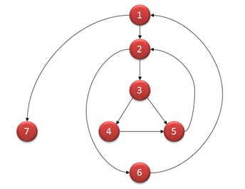

# SQA

Phần ôn thi giữa kì thì có thể dùng cái đề trong Repo trên Github á. Cái Lecture số 10 là cái quan trọng nhất và sau đó là Lecture 6. Các phần còn lại được tóm gọn lại từ Lecture nên chắc là ôn thì sẽ qua điểm liệt =))

## Lecture 1

Software Quality Assurance and Test-Driven Development

**Software Engineering & Software Failure:**

- Software is essential, complex, and challenging to develop without software engineering.
- Software failure occurs when it doesn't meet customer needs, contains bugs, is late, or overbudget.
- Consequences of software failure include money loss, safety risks, and business interruptions.

**Main Activities of Software Engineering:**

1. Software specification.
2. Software development.
3. Software validation.
4. Software evolution.

**Software Process & Software Process Model:**

- A software process is a set of activities leading to software production, including information on when/how activities are carried out and people's roles.
- Software process models describe a specific order for performing activities, such as Waterfall, Incremental, Iterative, Agile, Prototyping, and Formal Methods.

**SQA in Software Process:**

- SQA is an umbrella activity applicable in every stage of a software process, practiced by all roles.
- SQA ensures software quality while being built, unlike Quality Control, which is done on the final product.

**Attributes of Software Quality:**

- Usability, reliability, performance, process standards, testing, and structure/understandability.

**Test-Driven Development (TDD):**

- Originated from Extreme Programming (XP), with Kent Beck as the author.
- Basic principle: test first, write code in small iterations.
- TDD iteration: write a test, make it compile and fail, write code to make it pass, refactor code.
- Benefits of TDD: instant feedback, confidence, better development practices.
- JUnit is a popular testing framework for TDD in Java.

**TDD Example (Circle program):**

- Step 1: Write a test, make it compile, run it (FAIL).
- Step 2: Write code to make the test pass.
- Step 3: Refactor code, remove bad code, apply conventions.

## Lecture 2
**Summary of Lecture 2: Software Quality Concepts and Use-Case Modeling**

**Software Engineering Problems:**

- Long development time, high costs, late delivery, rapid obsolescence, difficult maintenance, and measuring software quality.

**Software Process:**

- A collection of activities, actions, and tasks for software development.
- 5 activities: communication, planning, modeling, construction, deployment.
- Umbrella activities: project tracking, risk management, quality assurance, technical reviews, measurement, configuration management, work product preparation.

**General Principles:**

- KISS (Keep It Simple & Stupid): make software understandable, maintainable, and less error-prone.
- Maintain the Vision: a clear vision is essential for project success.
- Be Open to the Future: make software modifiable, extendable, and upgradeable.
- What You Produce, Others Will Consume: always consider others who will understand, use, or maintain your work.

**Software Quality:**

- An effective software process creating a useful product with measurable value for producers and users.
- Challenges: developer's capability, product complexity, device & platform diversity.
- Values vs. Costs tradeoff: balance internal (defect correction) and external (customer support, repair) failure costs.

**The SQA Plan:**

- Roadmap for instituting software quality assurance, including purpose, scope, work products, standards, activities, tools, configuration management, roles, and record-keeping.

**Verification & Validation:**

- Verification: ensuring products meet established requirements.
- Validation: evaluating software to comply with requirements at the end of the development process.

**Quality Assurance Activities:**

- Process Quality Assurance: build, monitor, and improve the software process.
- Requirements Quality Assurance: elicit, specify, validate, plan, and document requirements.
- Software Modeling QA: choose, review, accept, and change models.
- Software Design QA: conduct technical review meetings and ensure designs are complete, readable, and implement requirements.
- Software Implementation QA: use pair programming, unit testing, integration testing, and system testing.

**Quality Dimensions & Factors:**

- Garvin's 8 quality dimensions: performance, features, reliability, conformance, durability, serviceability, aesthetics, and perception.
- McCall's 11 quality factors: correctness, reliability, efficiency, integrity, usability, maintainability, flexibility, testability, portability, reusability, and interoperability.

**Examples of Quality Factors:**

- Interoperability: Google Drive, Facebook login.
- Maintainability: Microsoft Windows updates.
- Conformance: HTML5, CSS3, BCNF normalization, Java coding conventions.
- Object-oriented programming, modular programming, open standards, libraries, and tools affect quality factors.

**Negative Examples of Quality:**

- Interoperability: iOS video upload to YouTube.
- Reliability: course website downtime.
- Maintainability: building new software instead of upgrading existing software.

**Use Case:**

- Requirements depiction from the end user's point of view.
- User stories, use-case diagrams, template-based description, and activity diagrams.
- User story template: "As a [person], I [want to], [so that]."

## Lecture 3

**Summary of Lecture 3: Software Quality Assurance and Capturing Requirements**

**Part 1: Software Quality Assurance**

**Elements of SQA:**

1. **Standards (IEEE, ISO)**: Concepts, definitions, and guidelines for SQA.
2. **Reviews & Audits**: Assessment of work product quality and process adherence.
   - Review: assess quality at any given stage.
   - Audit: check if a suitable process is followed.
3. **Testing**: Ensuring software meets requirements and functions as intended.
4. **Error/defect collection & analysis**: Identifying, tracking, and addressing issues.
5. **Change management**: Responding to changes in requirements or scope.
6. **Education**: Teaching software engineers and stakeholders about SQA.
7. **Vendor management**: Utilizing packaged, tailored, or custom-designed software.
8. **Security management**: Preventing software vulnerabilities and data breaches.
9. **Safety**: Ensuring user inputs don't lead to dangerous situations and software remains operational.
10. **Risk management**: Identifying and mitigating potential issues, such as misunderstood requirements or underestimated costs.

**SQA General Process:**

- Prepare an SQA plan.
- Participate in software process development.
- Verify project activities follow the defined process.
- Record and report deviations and non-compliant work products.
- Assist in change management.
- Collect and analyze software metrics.

**SQA Goals & Metrics:**

- Requirements quality.
- Design quality.
- Code quality.
- Effectiveness of quality control.

**Formal Approaches to SQA:**

- A small segment of software engineering, using mathematical objects and proofs to ensure program correctness.

**Statistical SQA:**

- Suitable for large software companies, involving error/defect collection, categorization, cause identification, and process improvement.

**Software Metric: Reliability**
- Definition: Probability of failure-free operation.
- Mean Time Between Failures (MTBF): Average time users wait per software failure.
- Mean Time To Repair (MTTR), Mean Time To Failure (MTTF), Mean Time To Acknowledge (MTTA).
- Reliability testing for measurement.

**Part 2: Capturing Requirements**

**Requirements Challenges:**

- Customers' inability to describe software.
- Problematic functional descriptions.
- Inconsistent or incomplete ideas.

**Requirements Tasks:**

- Finding out what users need.
- Documenting users' needs.
- Avoiding premature design assumptions.
- Resolving conflicting requirements.
- Eliminating redundant requirements.
- Ensuring requirements are traceable.

**Sources of Requirements:**

- Stakeholders.
- Documents.
- Existing systems.
- Business domain understanding.

**User Requirements Examples:**

- Payment and data maintenance records.
- Connectivity with central computer.
- App functionality and performance.

**Functional vs. Non-Functional Requirements:**

- Functional: Software behaviors and explicit actions.
- Non-functional: Constraints on services, functions, performance, and development.

**Quantitative Non-Functional Requirements:**

- Adapted from Sommerville, 2011.

**Requirements Engineering Activities:**

- Requirements elicitation (acquisition or discovery).
- Requirements analysis and negotiation.
- Methods of specifying requirements (data-flow diagrams, E-R models, use cases, activity diagrams, wireframes/mock-ups, prototypes).

**Data-flow diagrams, E-R diagrams, Use-case diagrams, Activity diagrams, Wireframes, Mockups, and Prototypes:**

- Brief explanations and examples of each method for specifying requirements.

## Lecture 4
**Summary of Lecture 4: System Modeling & Architecture**

**Types of Modeling:**

- **Context Modeling**: Defines the system boundary (e.g., Level-0 DFD, Use Case Diagram, System Architectural Model).
- **Interaction Modeling**: Describes interactions between users, system, and external systems (e.g., Use Case Modeling, Sequence Diagram).
- **Structural Modeling**: Identifies system components and their relationships (e.g., ER Modeling, Class Diagram).
- **Behavioral Modeling**: Shows how the system responds to environmental triggers (e.g., Sequence Diagram, State Diagram).

**Architectural Design:**

- Determines how a software system should be organized.
- Designs the overall system structure and identifies main components and their relationships.
- Output: an architectural model consisting of communicating components.
- Example: Robot Control System Architecture.

**Contexts of Architectural Design:**

- Small context: Architecture of individual programs.
- Large context: Enterprise systems including software, hardware, programs, and components.

**Benefits of Architectural Design:**

- Facilitates stakeholder discussions.
- Enables architecture reuse across systems.
- Aids analysis of non-functional requirements.

**Architectural Design Decisions:**

- Architecture re-use: Use similar architectures for systems in the same domain, software product lines, or well-known patterns.
- Architecture & system characteristics: Design for performance, security, availability, etc.

**Architectural Patterns:**

- Good design practices with information about usefulness and represented using tabular/graphical descriptions.

**Layered Architecture:**

- System organized into layers providing services.
- Supports incremental development of sub-systems in different layers.

**Client-Server Architecture:**

- Sub-systems exchange data, with client requesting services and server providing them.

**Repository Architecture:**

- Sub-systems share data through a central database or repository.
- Example: E-commerce platform with a shared order database.

**Call-and-Return Architecture:**

- Program structure easy to modify and scale.
- Main program/subprogram architecture or remote procedure call architecture.

**Model-View-Controller (MVC) Pattern:**

- A layered architecture separating presentation, interaction, and data management.
- Model: manages system data and operations.
- View: defines and manages data presentation.
- Controller: manages user interaction.

**Pipe and Filter Architecture:**

- Functional transformations process inputs to produce outputs sequentially.
- Not very suitable for interactive systems.
- Example: Language processing system using pipe and filter architecture.

## Lecture 5

**Software UI Review**

**Interaction Methods:**

- Command-line Interaction.
- Menu Interaction (Single-level, Multiple-level).
- Form Interaction.
- Icon-based Interaction.
- Natural Language Interaction.

**Interface Elements:**

- Input Controls: Buttons, text fields, checkboxes, dropdown lists, etc.
- Navigational Components: Breadcrumb, pagination, nav bars, menus, icons, etc.
- Informational Components: Texts, labels, tooltips, icons, message boxes, etc.
- Containers: Windows, boxes, modals, etc.

**UI Design Best Practices:**

1. **Simplicity**: Keep the interface simple and easy to understand.
2. **Consistency**: Maintain consistency in design elements, such as typography, alignment, sizes, and colors.
3. **Use common UI elements**: Leverage familiar UI elements to enhance usability.
4. **Purposeful layout**: Design the layout to draw users' attention to essential information.
5. **Use color and texture strategically**: Apply color palettes and contrast ratios effectively.
6. **Typography**: Use different sizes, fonts, and arrangements to improve scanability and readability.
7. **Communication**: Inform users about location, actions, state, or errors.
8. **Defaults**: Provide suggestions for user input to ease their burden.

**Common UI Elements:**

- Text Inputs, Buttons, Checkboxes & Radio buttons, Dropdowns & List boxes, Toggles, Navigational components, Informational components.

**UI Principles:**

- **Layout Consistency**: Maintain consistency in layout and relationships between elements.
- **Real-world consistency**: Use real-world objects to represent UI elements.
- **Relationships between elements**: Link related items and disassociate unrelated items.
- **Navigability**: Provide initial focus, assist in navigation, and avoid horizontal scrolling.
- **Simplicity**: Avoid complexity and ambiguity in UI design.

**Icon Guidelines:**

- Types of Icons: Universal, conflicting meaning, unique.
- Recommendations: Use labels, use icons as visual aids, place status icons at the end, and subject icons at the beginning.

**UI Review:**

- **Review Questions (1)**: Check labels, grouping, visual cues, and alignment.
- **Review Questions (2)**: Ensure consistent sizes, labels, and accessibility with keyboard navigation.
- **Common Problems**: Misaligned design elements, poorly rendered buttons, inconsistent sizes, labels, and alignment.
- **Assessing Logical Flow**: Evaluate tab navigation, initial focus, accessibility, and screen resolution compatibility.
- **Reviewing Text Elements**: Check consistency in terminology, spelling, punctuation, font use, and accessibility.
- **Reviewing Error Messages**: Ensure error messages are clear, useful, and informative.
- **Reviewing Navigability**: Verify dead links, unresponsive buttons, smooth navigation, and expected navigational behavior.

**Lecture 5** focuses on UI design principles, best practices, and reviewing UI elements to ensure usability, accessibility, and visual consistency. The lecture covers interaction methods, interface elements, UI design best practices, UI principles, icon guidelines, and provides a structured approach for reviewing and assessing user interfaces.


## Lecture 6

Cái này quan trọng nè, nhớ là cần phải học cách tính Coverage trong Lecture 6 để đi thi.

**Software Testing Principles:**

1. Test cases require expected output/result definitions.
2. Avoid self-testing; different teams should test programs.
3. Inspect test results thoroughly.
4. Test valid and invalid, expected and unexpected input conditions.
5. Test both positive (what it should do) and negative (what it should not do) aspects.
6. Avoid throwaway test cases unless the program is throwaway.
7. Assume errors will be found; plan for testing effort.
8. More errors are likely where previous errors were found.
9. Testing is creative and intellectually challenging.

**Part 1: Black-Box Testing Techniques**

1. **Decision Table Testing**: Test system behavior for different input combinations systematically.
2. **Equivalence Partitioning**: Divide input values into partitions and test at least one input from each partition.
   - Example: Valid (1-999), Invalid (<1, >999).
3. **Boundary-Value Analysis**: Test boundary values (edge of input equivalence classes) and output equivalence classes.
   - Guidelines: test ends of ranges, invalid inputs, ordered sets (first/last elements).

**Part 2: White-Box Testing Techniques**

1. **Basis Path Testing**: Analyze execution paths and test all paths in a program.
2. **Code Coverage**: Measure the degree to which source code has been tested.
   - Types: Statement, Decision, Branch, Condition Coverage.
   - Statement Coverage: Number of executed statements / Total number of statements.
   - Decision Coverage: Executed decision outcomes / Total decision outcomes.
   - Branch Coverage: Each branch must take on all possible outcomes at least once.
   - Condition Coverage: Tested Boolean outcomes / Total Boolean outcomes.
3. **Path Coverage**: Test all execution paths in the program.
4. **Documentation Testing**: Ensure software documentation accurately guides end-users.

To understand the difference between Code Coverage and Test Coverage, let's first understand the meaning of Test Coverage.

**Test Coverage**

It is a measure of how many parts of the expected testing have been covered during testing a software. By **'expected testing'** we mean the complete set of test cases that are written to be executed to test a given software.

Suppose, to test a software a set of 500 total test cases have been written. Now, as a part of the testing activity, only 300 test cases were executed. Let's assume this to be due to lack of time. In this case, the below would be the test coverage.

*Test Coverage = (Executed Test cases/Total Test cases) * 100*\
*= (300/500) * 100*\
*= 60 %*

Let's compare this with what Code Coverage is.

**Code Coverage**

It is a measure that shows the extent to which a source code of an application gets executed during testing the code. It thus shows the degree to which a source code would get tested.

Suppose to test an application with 500 lines of code, only 400 lines of the code get executed by tests. Let's assume that this is due to a certain loop/condition not getting executed. In this case, the below would be the code coverage.

*Code Coverage = (number of lines of code executed/ total number of lines of code)* 100*\
*= (400/500) * 100*\
*= 80 %*

**Enlisted below are the differences between Code Coverage and Test Coverage:**

### Methodologies

Here, we shall discuss the various methods that are/can be used to measure the Code Coverage. 

**To understand these methodologies, let's take a look at the below code snippet:**
 
```
Add (int a, int b) {
   If (b > a) {
      b = b - a
      Print b
   }
   If (a > b) {
      b = a – b
      Print b
   }
     Else Print ‘0’
}
```

 
#### Statement Coverage

This methodology is a measure that tells if all possible executable statements of code in source code have been executed at least once. It is a method to ensure that each line of the source code is covered at least once by the tests.

This might sound simple but caution needs to be exercised while measuring the Statement Coverage. The reason being, in a source code there could be a certain condition that might not get executed depending on the input values.

This would mean that all the lines of code would not be covered in testing. Thus, we may have to use different input value sets to cover all such conditions in the source code.

**For example,** in the above source code if input values are taken as 2 & 3 then, the 'Else' part of the code would not get executed. However, if the input values are of type 3 & 2 then the 'If' part of the code would not get executed.

This means that with either set of values of our Statement Coverage would not be 100%. In such a case, we may have to execute the tests with all three [(2, 3), (3, 2), (0, 0)] set of values to ensure 100% Statement Coverage.

#### Function Coverage

As the name suggests, this methodology measures the extent to which the functions present in source code are covered during testing. All functions that are in the source code get tested during test execution. Again, it must be ensured that we test these functions for varying values so that the function gets tested thoroughly.

In a source code there may be multiple functions and depending on the input values used a function may or may not be called. Thus the purpose of Function Coverage is to ensure that we have each function called for.

**For example,** in the source code above if our tests call the 'Add' function even once, then we would call this as a complete Function Coverage.

#### Condition Coverage

In a source code wherever we have a condition, the result would be a Boolean value of either true or false. Condition Coverage aims at establishing if the tests cover both the values i.e. true, false.

In the source code, when each occurring condition is evaluated for both true and false states, then the Condition Coverage for the code is said to be complete.

**For example,** in the above code if value sets (2, 3) and (4, 2) are used then Condition Coverage would be 100%. When data set (2, 3) is used then (b > a) evaluates to true and (a > b) evaluates to false. Similarly, when data set (4, 2) is used then (b > a) evaluates to false and (a > b) evaluates to true.

Thus both the conditions have both the values i.e true and false covered. Hence the Condition Coverage would be 100%.

#### Branch Coverage

This methodology aims at ensuring that every branch appearing in each conditional structure gets executed in source code. For instance, in the above code, all the 'If' statements and any accompanying 'Else' statement should all be covered by the test for a 100% Branch Coverage.

**For example,** in the above code if value sets (2, 3), (4, 2), (1, 1) are used then Branch Coverage would be 100%. When data set (2, 3) is used then (b > a) and the first 'If' branch gets executed. Similarly, when data set (4, 2) is used then (a > b) evaluates to true and the second 'If' branch gets executed.

Then with the data set (1, 1) the 'Else' branch evaluates to true and gets executed. Thereby, ensuring 100% Branch Coverage.

**Branch Coverage Vs Condition Coverage**

Branch Coverage is often confused with Condition Coverage, however, the two are different.

**Let's understand this with a simple example.**

If (a >0) & (b >0)
Then Print "Hello"
Else Print "Bye"

**Let us write down the data set needed for complete** **Branch Coverage:**

(1, 1) -- In this case, 'a' and 'b' both are true, so the If condition gets executed.\
(1, 0) -- In this case, 'a' is true and 'b' would be false, so the Else part of the code is executed.

As we know the purpose of Branch Coverage is to get every branch executed at least once and this purpose is achieved.

**Condition Coverage:**

(1, 0) -- In this case, 'a' is true and 'b' would be false.\
(0, 1) -- In this case, 'a' is false and 'b' would be true.

The purpose of Condition Coverage is to get each of true and false for every condition executed and this purpose is achieved here.

Did you notice that the else part does not get executed in Condition coverage? This is where Condition Coverage differs from Branch Coverage.

(Đây là phần được đi ăn cắp ở đâu đó)

**Part 3: Testing for Web Applications**

1. **Security Testing for Web Apps**:
   - SQL Injection: Prevent user inputs from causing unintended queries.
   - Cross-site Scripting (XSS) Attack: Prevent HTML tags in user input by escaping special characters.
   - File upload attack: Restrict allowed file extensions and disable execute permission on upload directory.
2. **Web Apps Performance Testing**:
   - Monitor CPU and Memory usage.
   - Use load testing tools (e.g., loader.io).
   - Inspect file sizes and count using browser developer tools.
3. **Web Apps White-Box Testing**:
   - Code inspections: HTML, CSS, JavaScript, server scripts.
   - Data inspections: Check data storage and alteration.
   - Web Server inspections: Check sessions and access/error log files.

## Lecture 6-2

**Summary of Lecture 6 Part 2: Source Code Review**

**Reviews & Inspections:**

- Code Review/Program Inspection: Check source code for bugs and improve code quality.
- Other review activities: Design, Software Product, Documentation, Process review.

**Objectives & Organization:**

- Find & fix errors.
- Improve code readability & maintainability.
- Two levels: High (code architecture), Low (specific code).
- Well-defined package/folder structure, clear hierarchy, relevant classes & resources together.
- Manage relationships among software components.

**Code Quality Metrics:**

- Coupling Between Object Classes: Measure class dependencies.
- Depth of Inheritance Tree (DIT): Measure design complexity.
- Number of methods per class: Indicate implementation & testing effort.
- Fan-in/Fan-out: Measure method dependencies.

**Clean Code Principles:**

- **Why clean code matters:** More time spent reading than writing code.
- **The Boy Scout Rule:** Leave code cleaner than found.
- **Meaningful Names:** Use specific, clear, concise names.
- **Functions (methods) should be small, do one thing, contain one level of abstraction, avoid side effects.**
- **Reading code from top to bottom:** Follow the Stepdown Rule.
- **Good, warning, and insignificant comments.**

**Code Formatting:**

- Line length, blank lines, related lines close together.

**References:**

- Pressman & Maxim, "Software Engineering" (9th edition).
- Robert C. Martin, "Clean Code" (2008).

## Lecture 7

**Software Design - Modularity and UML Sequence Diagram**

**Modular Software Design:**

- Addresses software scalability problems.
- Breaks software into understandable, reusable, and composable modules.
- Key issues: Coupling (dependencies), Cohesion (self-contained components).

**Coupling & Cohesion:**

- **Coupling:** Measure of module dependencies; objective: independent components.
- **Cohesion:** Measure of how well parts of a component fit; objective: self-contained, single-purpose components.
- **Reducing Coupling:** Separation of concerns, single abstraction, minimal dependencies.
- **Increasing Cohesion:** Single responsibility, cohesive functionality.

**Class Design & Documentation:**

- Separation of concerns, completeness, consistency.
- External (design specification) and internal (implementation notes) documentation.
- Class cohesion: do one thing, separate UI, avoid long parameter lists, consistent method names.

**UML Sequence Diagram:**

- Depicts object interactions over time.
- Vertical axis: time, horizontal axis: participating objects.
- Elements: Objects, Lifelines, Messages, Activations, Synchronous/Asynchronous/Simple messages.

**Use Case Diagram & Sequence Diagram Example:**

- School registration system use case: "Register for classes".
- Normal flow: open course with prerequisites.
- Sequence diagram: Show interactions between objects (student, course, registration system) during the registration process.

## Lecture 8

**Summary of Lecture 8: Software Testing**

**Part I: A Perspective on Testing**
- **Testing Goals:**
  - Demonstrate software meets requirements.
  - Discover incorrect implementation and defects.
- **Ensuring Software Correctness:**
  - Testing is essential but insufficient.
  - Tools, inspection, and testing cover around 97% of bugs.
- **Industry Trend:**
  - Small to nonexistent testing teams, programmers test their code.
  - Reasons: ease of updates, popularity of Test-Driven Development.

**Part II: Unit Testing**
- **Unit Testing Example:**
  - Test `Math.avg()` method with different inputs.
- **Testing Process:**
  - Write the test: choose input, define expected outcome.
  - Run the test: run with input, record actual outcome, compare with expected.
- **Testing Difficulties:**
  - Exhaustive testing is impractical.
  - Key problem: choosing a sufficient yet manageable test suite.
- **Techniques to Identify Test Cases:**
  - Equivalence Partitioning, Boundary Value Analysis, Decision Table-Based Testing, Graph-Based Testing.

**Equivalence Partitioning:**

- Identify test cases using one element from each equivalence class.
- Example: Valid equivalence class for input `x` (1 ≤ x ≤ 999).

**Boundary Value Analysis:**

- Errors tend to occur near extreme values of input variables.
- Test cases at minimum/maximum, just below/above, and a nominal value.
- Example: Validate `score` within range 0-10.
- Guidelines: Test ends of range, invalid inputs, nominal values.
- Limitations: Independent quantities, not suitable for booleans or dependent parameters.

**References:**

- Pressman & Maxim, "Software Engineering" (9th edition).
- Jorgensen & DeVries, "Software Testing" (5th edition).

## Lecture 9

**Summary of Lecture 9: Security Engineering**

**Security Considerations:**

- Consider security from the beginning, not as an afterthought.
- Security layers (antivirus, firewall/IPS) cannot protect from bug/glitch exploitations.
- Security threats: desktop, mobile, web applications.

**General Guidelines:**

- Think of all possible threats.
- Follow language and software type-specific guidelines.
- Reuse trusted code.
- Write good-quality, readable code.

**Best Practices:**

1. **Error Handling:**

   - Display generic error messages.
   - Handle all exceptions.
   - Log important user activities.

2. **Network Security:**

   - Use HTTPS everywhere.
   - Set proper file access/execution permissions.

3. **Password Storage:**

   - Store encrypted passwords (strong, salted hash).
   - Use tokenization to reduce data exposure.

4. **Infrastructure Strengthening:**

   - Configure infrastructure according to security best practices.
   - Educate team and customers on security.

5. **Credential Management:**

   - Do not hard-code credentials.
   - Enforce password policy.

6. **Database Access:**

   - Use up-to-date database access methods (parameterized queries, prepared statements).
   - Use appropriate data encoding.

7. **Input Validation:**

   - Validate all inputs.
   - Choose safe defaults.

8. **Performance and Resilience:**

   - Keep bottlenecks light.
   - Do not trust client-side validation.

9. **Concurrency and Shell Calls:**

   - Be careful with race conditions and system shell calls.

**References:**

- Lecture slides and examples provided by the instructor.

## Lecture 10

Cái này cần lưu ý và học cách tính. Cứ tóm tắt trước xong viết tiếp sau

**Software Measurement Techniques (Formal Methods)**

**Cyclomatic Complexity:**

- Measures control complexity of a program.
- Calculated as V(G) = E - N + 2P, where:
  - E: number of edges
  - N: number of nodes
  - P: number of nodes with conditions
- Ranges: 1-4 (low), 5-7 (moderate), 8-10 (high), 11+ (very high)

How to Calculate Cyclomatic Complexity
--------------------------------------

**Mathematical representation:**

Mathematically, it is set of independent paths through the graph diagram. The Code complexity of the program can be defined using the formula --

V(G) = E - N + 2

**Where,**

E -- Number of edges

N -- Number of Nodes

V (G) = P + 1

Where P = Number of predicate nodes (node that contains condition)

**Example --**

```
i = 0;
n=4; //N-Number of nodes present in the graph

while (i<n-1) do
j = i + 1;

while (j<n) do

if A[i]<A[j] then
swap(A[i], A[j]);

end do;
j=j+1;

end do;
```



**Computing mathematically,**

-   V(G) = 9 -- 7 + 2 = 4
-   V(G) = 3 + 1 = 4 (Condition nodes are 1,2 and 3 nodes)
-   Basis Set -- A set of possible execution path of a program
-   1, 7
-   1, 2, 6, 1, 7
-   1, 2, 3, 4, 5, 2, 6, 1, 7
-   1, 2, 3, 5, 2, 6, 1, 7

Properties of Cyclomatic complexity: Following are the properties of Cyclomatic complexity:

1.  V (G) is the maximum number of independent paths in the graph
2.  V (G) >=1
3. G will have one path if V (G) = 1
4. Minimize complexity to 10

**Halstead’s Metrics:**

- Based on operators and operands, predicts maintenance effort.
- Weighted Methods per Class: indicator of implementation and testing effort.

**Object-Oriented Metrics:**

- Depth of Inheritance Tree: measures design complexity and reuse potential.
- Number of Children: indicates class division, testing needs, reuse potential.
- Coupling Between Object Classes: measures dependencies, complexity, maintainability, reusability.

**Formal Methods:**

- Precise mathematical techniques for software specification and development.
- Finite State Machine (FSM):
  - Finite set of states (Q), input alphabet (∑), transition function (δ), initial state (q0), final states (F).
  - Accepts input strings containing characters from ∑.
  - Transition function specified using a table or graph.

**Example FSM:**

- Accepts "hello" or "hi":
  - States: Q = {q0, q1, q2, q3, q4, q5, q6}
  - Alphabet: ∑ = {e, h, i, l, o}
  - Final state: F = {q5}
  - Transition function and graph provided.
  

## Lecture 11

**Summary of Lecture 11: Software Measurement and The SQA Plan**

**Software Metrics:**

- Control metrics (process/project)
- Product metrics (quality of software product)
- Used for calculating quality attributes, spotting abnormal components

**Types of Product Metrics:**

- Dynamic (execution efficiency & reliability)
- Static (complexity, understandability, maintainability)

**Static Product Metrics Examples:**

1. Fan-in/Fan-out
2. Length of code
3. Cyclomatic complexity
4. Average length of identifiers
5. Depth of conditional nesting
6. Fog index (documentation)
7. Weighted methods per class (WMC)
8. Depth of inheritance tree (DIT)
9. Number of children (NOC)
10. Coupling between object classes (CBO)
11. Code coverage

**The SQA Plan:**

- Roadmap for software quality assurance
- Overlaps with project plan
- Layout:
  1. Purpose & scope
  2. Work products
  3. SQA actions & tasks
  4. Tools & methods for SQA
  5. Configuration management
  6. Records management
  7. Roles & responsibilities

**SQA Best Practices:**

- Get to know team members
- Keep updated on progress
- Act fast, be flexible
- Have a plan, be efficient
- If inexperienced, keep a list of SQA activities, learn along the way

## Final

**Summary of Lecture 12: Design Patterns and Quality Assurance Summary**

**Design Patterns:**

- Standard solutions to common programming problems.
- Benefits: known to work well, easier to understand.

**Design Patterns (Examples):**

1. **Encapsulation:** Hide fields, use getters/setters.
2. **Sub-classing:** Inherit members from superclass.
3. **Exceptions:** Throw/catch errors instead of return codes.
4. **Generics:** Use generic types for collection data structures.
5. **Iteration:** Use iterators for collection traversal.
6. **Factory Method:** Decide object subtype at runtime.
7. **Prototype:** Object is its own factory (clone()).
8. **Singleton:** Reuse existing object, hide constructor.
9. **Interning:** Reuse immutable objects.
10. **Wrappers:** Translate between incompatible interfaces (Adapter, Decorator, Proxy).

**Quality Assurance Summary:**

- **Quality Concepts:**
  - Garvin’s Quality Dimensions
  - McCall’s Quality Factors
  - ISO 9126 Quality Factors
  - Costs of Software Quality
  - Quality Control & Assurance
- **Elements of Quality Assurance:**
  - Standards (ISO 9000, CMMI, IEEE)
  - Reviews & Audits
  - Testing
  - Change Management
  - Security Management
  - Metrics
- **Software Testing:**
  - Strategies (Unit, Integration, System, Validation, UAT)
  - Techniques (Black-box, White-box)
